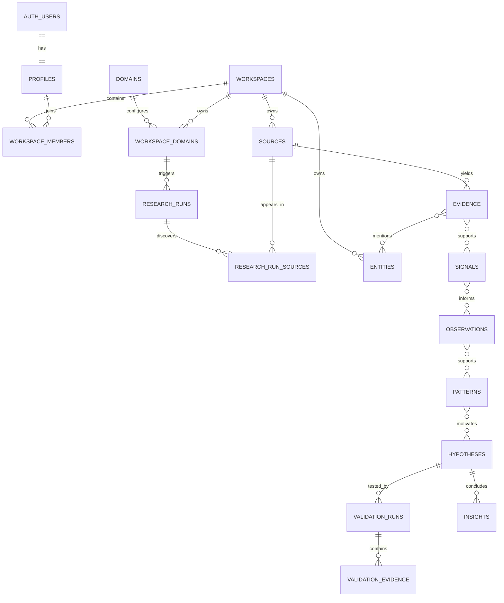

# Database Schema

This is the canonical logical schema for the Supabase PostgreSQL database. It gives frontend, backend, and n8n contributors one shared model before migrations are written. All tenant-owned records carry `workspace_id`, all intelligence objects preserve lineage, and all asynchronous writes are idempotent.

## Conventions

- Primary keys are UUIDs generated by the database.
- Times use `timestamptz` in UTC and names end in `_at`.
- Probabilities and normalized scores use `numeric(4,3)` from `0.000` through `1.000`.
- Flexible provider data belongs in `jsonb metadata`; fields used for filtering, joins, authorization, or UI state are typed columns.
- User-facing deletion is soft deletion with `deleted_at` unless legal or operational policy requires hard deletion.
- Every mutable table has `created_at`, `updated_at`, and where meaningful `created_by`.
- Status values use database enums or checked text values, not unconstrained strings.
- Foreign keys use `on delete cascade` only for true child records. Evidence lineage is not silently destroyed.
- n8n writes include an `idempotency_key` or use a documented natural uniqueness constraint.

## Relationship overview

## Identity and tenancy

### `profiles`

Application profile paired one-to-one with `auth.users`.

| Column | Type | Rules |
|---|---|---|
| `user_id` | uuid | PK and FK to `auth.users.id` |
| `display_name` | text | nullable |
| `avatar_url` | text | nullable |
| `timezone` | text | IANA timezone, default UTC |
| `onboarding_state` | text | `not_started`, `in_progress`, `complete` |
| `created_at`, `updated_at` | timestamptz | required |

### `workspaces`

Tenant boundary. The MVP creates one personal workspace per user.

| Column | Type | Rules |
|---|---|---|
| `id` | uuid | PK |
| `name` | text | required |
| `slug` | text | unique, required |
| `workspace_type` | text | `personal` or `team` |
| `created_by` | uuid | FK to profiles |
| `settings` | jsonb | display and product defaults only |
| `created_at`, `updated_at`, `deleted_at` | timestamptz | timestamps |

### `workspace_members`

| Column | Type | Rules |
|---|---|---|
| `workspace_id` | uuid | FK, part of PK |
| `user_id` | uuid | FK, part of PK |
| `role` | text | `owner`, `admin`, `member`, `viewer` |
| `joined_at` | timestamptz | required |

Unique: `(workspace_id, user_id)`. Each workspace must retain at least one owner; enforce through a protected function or application transaction.

## Domain configuration

### `domains`

Global catalog, readable by authenticated users.

| Column | Type | Rules |
|---|---|---|
| `id` | uuid | PK |
| `key` | text | unique stable key, such as `artificial-intelligence` |
| `name` | text | required |
| `description` | text | required |
| `default_config` | jsonb | versioned starter topics, entities, and sources |
| `config_version` | integer | required |
| `is_active` | boolean | required |

### `workspace_domains`

| Column | Type | Rules |
|---|---|---|
| `id` | uuid | PK |
| `workspace_id` | uuid | FK, required |
| `domain_id` | uuid | FK, required |
| `name` | text | optional user label |
| `topics` | text[] | required, default empty |
| `geographies` | text[] | required, default empty |
| `entity_types` | text[] | required, default empty |
| `source_config` | jsonb | enabled adapters and per-source settings |
| `collection_frequency` | text | `manual`, `daily`, `weekly` |
| `status` | text | `draft`, `active`, `paused`, `archived` |
| `created_by` | uuid | FK to profiles |
| `created_at`, `updated_at` | timestamptz | required |

Unique: `(workspace_id, domain_id, name)` where not archived.

## Research ingestion

### `research_runs`

One traceable Research Engine execution.

| Column | Type | Rules |
|---|---|---|
| `id` | uuid | PK |
| `workspace_id` | uuid | FK, required |
| `workspace_domain_id` | uuid | FK, required |
| `trigger_type` | text | `manual`, `schedule`, `validation`, `backfill` |
| `status` | text | `queued`, `discovering`, `extracting`, `verifying`, `analyzing`, `partial`, `completed`, `failed`, `cancelled` |
| `request_id` | uuid | trace identifier |
| `idempotency_key` | text | required |
| `contract_version` | text | required |
| `config_snapshot` | jsonb | immutable run configuration |
| `metrics` | jsonb | counts and durations by stage |
| `error_summary` | jsonb | sanitized failure details |
| `requested_by` | uuid | nullable for schedules |
| `started_at`, `completed_at`, `created_at` | timestamptz | timestamps |

Unique: `(workspace_id, idempotency_key)`.

### `sources`

A workspace-owned canonical source. Keeping sources workspace-scoped makes authorization and personal knowledge state unambiguous; cross-workspace deduplication can be introduced later through a private content catalog.

| Column | Type | Rules |
|---|---|---|
| `id` | uuid | PK |
| `workspace_id` | uuid | FK, required |
| `canonical_url` | text | required |
| `original_url` | text | required |
| `title` | text | required |
| `source_type` | text | article, company_page, paper, filing, repository, transcript, post, dataset, other |
| `publisher` | text | nullable |
| `author` | text | nullable |
| `published_at` | timestamptz | nullable |
| `first_discovered_at`, `last_discovered_at` | timestamptz | required |
| `content_hash` | text | nullable until extraction |
| `content_storage_path` | text | nullable; raw or cleaned content object path |
| `storage_class` | text | `S0` through `S5` from the retention policy; default `S0` |
| `content_expires_at` | timestamptz | nullable retention deadline |
| `language` | text | BCP 47 code |
| `source_quality_score` | numeric(4,3) | nullable |
| `extraction_status` | text | `pending`, `success`, `partial`, `failed`, `blocked` |
| `evidence_status` | text | `pending`, `accepted`, `rejected`, `needs_review` |
| `metadata` | jsonb | provider-specific details |
| `created_at`, `updated_at`, `deleted_at` | timestamptz | timestamps |

Unique: `(workspace_id, canonical_url)`. Optional duplicate guard: `(workspace_id, content_hash)` where content hash is not null.

### `research_run_sources`

Many-to-many discovery ledger that records why a source was accepted, rejected, or deduplicated in a run.

The physical Supabase schema also stores `workspace_id` on this and every tenant-owned join table. Composite foreign keys enforce that both parents belong to that workspace and make RLS direct and auditable.

| Column | Type | Rules |
|---|---|---|
| `research_run_id` | uuid | FK, part of PK |
| `source_id` | uuid | FK, part of PK |
| `discovery_source` | text | required |
| `query` | text | nullable |
| `rank` | integer | nullable |
| `relevance_score` | numeric(4,3) | nullable |
| `decision` | text | `accepted`, `rejected`, `duplicate`, `failed` |
| `decision_reasons` | text[] | required, default empty |
| `discovered_at` | timestamptz | required |

### `evidence`

| Column | Type | Rules |
|---|---|---|
| `id` | uuid | PK |
| `workspace_id` | uuid | FK, required |
| `source_id` | uuid | FK, required |
| `research_run_id` | uuid | FK, required |
| `evidence_type` | text | `fact`, `quote`, `metric`, `event`, `claim`, `counter_claim` |
| `claim_text` | text | normalized proposition, required |
| `excerpt` | text | source-grounded excerpt, required |
| `locator` | jsonb | section, paragraph, page, timestamp, or selector |
| `polarity` | text | `supports`, `contradicts`, `neutral` relative to target claim when used |
| `confidence` | numeric(4,3) | required |
| `verification_status` | text | `unverified`, `verified`, `disputed`, `rejected` |
| `extractor_version` | text | required |
| `metadata` | jsonb | optional structured values |
| `created_at`, `updated_at` | timestamptz | required |

The excerpt must respect source licensing and quotation limits. Store full extracted content separately when permitted.

## Entity graph

### `entities`

Domain-agnostic base entity for organizations, people, funds, products, technologies, markets, geographies, regulators, and other resolvable subjects.

| Column | Type | Rules |
|---|---|---|
| `id` | uuid | PK |
| `workspace_id` | uuid | FK, required |
| `entity_type` | text | required controlled value |
| `name` | text | required |
| `normalized_name` | text | required |
| `canonical_url` | text | nullable |
| `external_ids` | jsonb | provider identifiers |
| `attributes` | jsonb | type-specific fields |
| `resolution_status` | text | `provisional`, `resolved`, `merged`, `rejected` |
| `merged_into_id` | uuid | self FK, nullable |
| `created_at`, `updated_at` | timestamptz | required |

Index `(workspace_id, entity_type, normalized_name)`. Do not make name alone unique.

### `entity_aliases`

Columns: `id`, `workspace_id`, `entity_id`, `alias`, `normalized_alias`, `source_id`, `created_at`. Unique `(workspace_id, entity_id, normalized_alias)`.

### `evidence_entities`

Columns: `evidence_id`, `entity_id`, `role`, `confidence`. Primary key `(evidence_id, entity_id, role)`.

### `relationships`

Typed, time-aware graph edge.

| Column | Type | Rules |
|---|---|---|
| `id` | uuid | PK |
| `workspace_id` | uuid | FK, required |
| `from_entity_id`, `to_entity_id` | uuid | FK, required |
| `relationship_type` | text | invested_in, founded, employed_by, partnered_with, acquired, competes_with, uses_technology, other |
| `direction` | text | `directed` or `undirected` |
| `valid_from`, `valid_to` | date | nullable |
| `confidence` | numeric(4,3) | required |
| `attributes` | jsonb | amount, round, role, and other typed details until promoted |
| `created_at`, `updated_at` | timestamptz | required |

### `relationship_evidence`

Columns: `relationship_id`, `evidence_id`, `polarity`; primary key `(relationship_id, evidence_id)`.

Investment rounds can initially use relationships with structured attributes. Promote them to a dedicated `investments` table when product queries require strict amount, currency, stage, lead-investor, and participant semantics.

## Intelligence layers

Every table below includes `workspace_id`, `workspace_domain_id`, `engine_version`, `status`, `confidence`, `created_at`, and `updated_at` unless noted.

### `signals`

Additional columns: `id`, `signal_type`, `title`, `summary`, `event_at`, `novelty_score`, `importance_score`, `geographies`, `metadata`, `supersedes_signal_id`.

Status: `draft`, `accepted`, `rejected`, `superseded`.

### `signal_evidence`

Columns: `signal_id`, `evidence_id`, `role` (`supporting`, `contradicting`, `context`), `weight`. Primary key `(signal_id, evidence_id, role)`.

### `signal_entities`

Columns: `signal_id`, `entity_id`, `role`; primary key `(signal_id, entity_id, role)`.

### `observations`

Columns: `id`, `title`, `statement`, `observation_type`, `time_window_start`, `time_window_end`, `metadata`.

### `observation_signals`

Columns: `observation_id`, `signal_id`, `role`, `weight`. Primary key `(observation_id, signal_id)`.

### `theses`

Columns: `id`, `subject_entity_id`, `thesis_type` (`stated`, `revealed`), `statement`, `time_window_start`, `time_window_end`, `methodology`, `metadata`.

### `thesis_evidence`

Columns: `thesis_id`, `evidence_id`, `role`, `weight`. Primary key `(thesis_id, evidence_id)`.

### `patterns`

Columns: `id`, `pattern_type`, `title`, `statement`, `strength_score`, `persistence_score`, `evidence_diversity_score`, `time_window_start`, `time_window_end`, `first_detected_at`, `last_confirmed_at`, `metadata`.

Status: `emerging`, `persistent`, `weakening`, `contradicted`, `archived`.

### `pattern_observations`

Columns: `pattern_id`, `observation_id`, `role` (`supporting`, `contradicting`, `context`), `weight`. Primary key `(pattern_id, observation_id, role)`.

### `hypotheses`

| Column | Type | Rules |
|---|---|---|
| `id` | uuid | PK |
| `workspace_id`, `workspace_domain_id` | uuid | required FKs |
| `title` | text | required |
| `statement` | text | testable claim, required |
| `target_user` | text | required |
| `problem` | text | required |
| `proposed_value` | text | nullable |
| `assumptions` | jsonb | array of testable assumptions |
| `origin` | text | `user`, `engine`, `mixed` |
| `status` | text | `draft`, `ready_for_validation`, `validating`, `supported`, `mixed`, `weakened`, `inconclusive`, `archived` |
| `confidence` | numeric(4,3) | required |
| `engine_version` | text | nullable for fully user-authored drafts |
| `created_by` | uuid | nullable for engine output |
| `created_at`, `updated_at`, `deleted_at` | timestamptz | timestamps |

### `hypothesis_patterns`

Columns: `hypothesis_id`, `pattern_id`, `role`, `weight`. Primary key `(hypothesis_id, pattern_id)`.

### `validation_runs`

| Column | Type | Rules |
|---|---|---|
| `id` | uuid | PK |
| `workspace_id` | uuid | required FK |
| `hypothesis_id` | uuid | required FK |
| `research_run_id` | uuid | nullable FK for validation research |
| `status` | text | `queued`, `researching`, `synthesizing`, `completed`, `partial`, `failed`, `cancelled` |
| `dimensions` | text[] | competitor, demand, adoption, funding, technical, regulatory, incumbent, failed_attempt, counter_signal |
| `methodology` | jsonb | immutable search and evaluation plan |
| `result` | text | nullable until complete: `supported`, `mixed`, `weakened`, `inconclusive` |
| `confidence` | numeric(4,3) | nullable until complete |
| `summary` | text | nullable until complete |
| `unresolved_questions` | text[] | required, default empty |
| `engine_version`, `idempotency_key` | text | required |
| `started_at`, `completed_at`, `created_at` | timestamptz | timestamps |

### `validation_evidence`

Columns: `id`, `workspace_id`, `validation_run_id`, `evidence_id`, `dimension`, `stance` (`supporting`, `contradicting`, `neutral`), `weight`, `reasoning_summary`, `created_at`.

### `insights`

Columns: `id`, `workspace_id`, `workspace_domain_id`, `hypothesis_id` nullable, `validation_run_id` nullable, `title`, `conclusion`, `confidence`, `limitations`, `status` (`draft`, `published`, `superseded`, `archived`), `engine_version`, `created_at`, `updated_at`.

An insight must have either a completed validation run or an explicitly documented analytical basis.

## Product and operations

### `saved_items`

Columns: `id`, `workspace_id`, `user_id`, `item_type`, `item_id`, `annotation`, `tags`, `created_at`, `updated_at`. Unique `(workspace_id, user_id, item_type, item_id)`.

Use an allowlist and application validation for polymorphic targets. If referential integrity becomes a problem, split this into typed bookmark tables.

### `daily_briefs`

Columns: `id`, `workspace_id`, `workspace_domain_id`, `brief_date`, `title`, `summary`, `content`, `status`, `source_cutoff_at`, `engine_version`, `created_at`, `updated_at`. Unique `(workspace_domain_id, brief_date)`.

### `llm_usage`

| Column | Type | Rules |
|---|---|---|
| `id` | uuid | PK |
| `workspace_id` | uuid | required FK |
| `research_run_id`, `validation_run_id` | uuid | nullable FKs |
| `request_id` | uuid | trace identifier |
| `workflow`, `agent`, `operation` | text | required |
| `provider`, `model` | text | required |
| `model_tier` | smallint | 0 through 3 |
| `input_tokens`, `output_tokens` | bigint | nonnegative |
| `estimated_cost_usd` | numeric(12,6) | nonnegative |
| `latency_ms` | integer | nonnegative |
| `success` | boolean | required |
| `error_code` | text | nullable |
| `prompt_version`, `schema_version` | text | required |
| `created_at` | timestamptz | required |

### `job_runs`

Cross-system status ledger for background work. Columns: `id`, `workspace_id`, `job_type`, `subject_type`, `subject_id`, `status`, `request_id`, `idempotency_key`, `attempt`, `max_attempts`, `progress`, `error_summary`, `queued_at`, `started_at`, `completed_at`. Unique `(workspace_id, idempotency_key)`.

### `audit_log`

Append-only record of security-sensitive user and service actions. Columns: `id`, `workspace_id`, `actor_type`, `actor_id`, `action`, `target_type`, `target_id`, `request_id`, `metadata`, `created_at`.

## n8n research runtime functions

Migration `202609270007_n8n_research_runtime.sql` exposes four Data API functions to the `service_role` only:

| Function | Purpose |
|---|---|
| `n8n_claim_research_run` | Atomically changes one matching queued run to `discovering` and returns its trusted configuration. |
| `n8n_set_research_run_status` | Applies forward-only stage or terminal status changes with metrics and sanitized error patches. |
| `n8n_record_research_source` | Enforces workspace lineage, canonical/content deduplication, discovery ledger persistence, and review-only acceptance rules. |
| `n8n_record_research_evidence` | Persists replay-safe evidence, enforces source/run workspace lineage, and downgrades model verification in review-only mode. |

`anon` and `authenticated` cannot execute these functions. A Supabase secret key used by n8n can call them and therefore must remain in the n8n credential store. See [How to Build the First n8n Research Agent](../operations/how_to_build_first_n8n_research_agent.md).

## Essential indexes

- Every tenant table: `(workspace_id, created_at desc)`.
- Membership: `(user_id, workspace_id)`.
- Research runs: `(workspace_domain_id, created_at desc)` and partial index on active statuses.
- Sources: unique `(workspace_id, canonical_url)` and partial `(workspace_id, content_hash)`.
- Evidence: `(source_id)`, `(research_run_id)`, replay guard on the source/extractor/claim/excerpt hash, and full-text or vector index only after benchmarked need.
- Entities: `(workspace_id, entity_type, normalized_name)` plus GIN on `external_ids` only if queried.
- Signals: `(workspace_domain_id, event_at desc)`, `(workspace_id, status, importance_score desc)`.
- Patterns and hypotheses: `(workspace_domain_id, status, updated_at desc)`.
- Usage: `(workspace_id, created_at desc)`, `(research_run_id)`, `(validation_run_id)`.

Avoid indexing every JSONB column. Add indexes from observed query plans.

## Database views for the product

Expose stable views or API queries rather than making the frontend reconstruct graphs:

- `v_dashboard_signal_cards`
- `v_pattern_summaries`
- `v_hypothesis_validation_status`
- `v_research_run_health`
- `v_workspace_cost_daily`
- `v_source_lineage`

Views must preserve workspace filters and use `security_invoker` behavior where supported. Materialized views require an explicit refresh and tenant-isolation design.

## Migration order

1. Extensions, helper functions, and common enums.
2. Profiles, workspaces, and membership.
3. Domains and workspace domain configuration.
4. Research runs, sources, evidence, and lineage joins.
5. Entities and relationships.
6. Intelligence layer tables.
7. Product, usage, job, and audit tables.
8. RLS policies and policy tests.
9. Views, indexes, and seed data.

Before migrating existing prototype data, map each old row to a workspace, preserve original identifiers in metadata, and record any information that cannot satisfy the new lineage requirements.
