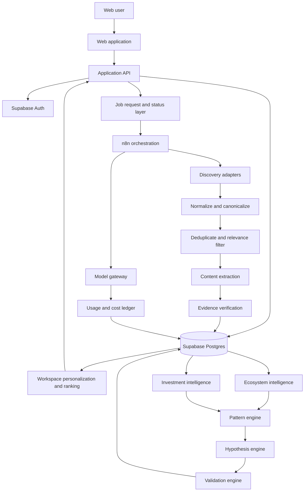

# System Architecture

The platform uses one shared Research Engine to build a reusable domain evidence base. Scheduled public research is collected once per active domain in a private service research workspace, then ranked separately for each eligible workspace. Analytical engines consume that evidence through stable contracts; they do not browse independently. The web application reads product data through a backend boundary, while n8n performs asynchronous orchestration.

## Architecture goals

- Preserve complete lineage from insight to external source.
- Keep workspace data isolated.
- Make workflows repeatable, observable, and safe to retry.
- Keep deterministic work outside LLMs.
- Allow frontend, backend, and workflow contributors to build against stable contracts.
- Keep the engine domain-agnostic while shipping Artificial Intelligence first.
- Reuse each domain collection run across eligible workspaces without sharing private tenant data.
- Personalize feeds deterministically and explainably without per-user crawling.

## Logical view

## Component boundaries

### Web application

Owns presentation, browser-safe session handling, optimistic user interactions, filters, and view state. It never holds a Supabase service-role key and never calls an external model provider directly.

### Application API

Owns authorization-aware product operations, input validation, stable frontend view models, job requests, saved items, and user-authored hypothesis changes. It may use Supabase directly with the user session or run trusted server operations after explicitly checking workspace membership.

### Supabase

Owns authentication, tenant-scoped persistence, relationships, lineage, indexes, RLS, storage references, and realtime updates where useful. The database is the system of record; n8n execution history is not.

### n8n

Owns schedules, source orchestration, retries, transformations, extraction calls, model calls, and long-running intelligence jobs. It does not own browser authorization, product permissions, or the canonical definition of stored objects.

### Model gateway

Provides one route for model selection, structured output validation, retry policy, and usage recording. Workflows request a capability and budget class rather than hard-coding a provider where possible.

### Discovery adapters

Convert channel-specific results into candidates for the Universal Research Contract. An adapter may discover content but cannot write signals or hypotheses directly.

### Intelligence engines

Consume accepted evidence packs and write versioned analytical outputs. Each engine is idempotent for a given input set and engine version.

## Data flow and ownership

| Data | Writer | Readers | System of record |
|---|---|---|---|
| Account and membership | Application and Supabase Auth | Application, RLS | Supabase |
| Domain configuration | Application | Research Engine, UI | Supabase |
| Research run | Application or scheduler; n8n updates | UI, operations | Supabase |
| Source candidate | Discovery adapter | Normalization stages | Workflow execution only until accepted |
| Accepted source and evidence | Research Engine | All intelligence engines, UI | Supabase |
| Personalization profile and feed references | Application and ranking service | Application, UI | Supabase |
| Signal and observation | Intelligence engines | Pattern engine, UI | Supabase |
| Pattern | Pattern engine | Hypothesis engine, UI | Supabase |
| Hypothesis | Engine or user | Validation engine, UI | Supabase |
| Validation result | Validation engine | UI, insight engine | Supabase |
| Saved state and annotation | User through application | UI | Supabase |
| Usage and estimated cost | Model gateway or workflow wrapper | UI, operations | Supabase |

## Synchronous and asynchronous operations

Synchronous operations should normally finish in less than a few seconds: authentication, configuration reads and writes, feed queries, saving an item, editing a hypothesis, and requesting a background job.

Asynchronous operations include source collection, extraction, intelligence analysis, pattern recomputation, validation, and brief generation. The API returns a job or run identifier immediately. The UI polls or subscribes to status and shows partial, failed, and stale states.

Scheduled public collection follows [Shared Domain Collection and Personalization](shared_domain_collection_and_personalization.md): two configurable slots per active domain each day, skipped when no workspace subscribes, with downstream workspace ranking over the shared corpus. Private workspace material remains on a separate tenant-owned path.

## Event and job convention

Every background request carries:

- `request_id` for end-to-end tracing.
- `idempotency_key` to prevent duplicate effects.
- `workspace_id` and, where applicable, `workspace_domain_id`.
- `requested_by` or `trigger_type`.
- `schema_version` and engine version.
- A cost ceiling or budget policy reference.

The database records state transitions. A workflow may resume from the last completed stage; it must not rely only on n8n’s internal history.

## Failure principles

- A failed source does not fail the whole run unless a configured minimum coverage threshold is missed.
- Invalid structured model output is rejected and retried within a bounded policy.
- Retrying an accepted item is idempotent.
- Partial results are marked as partial, never shown as complete.
- A downstream engine cannot run on an evidence pack that has not reached `accepted` status.
- Raw provider errors are retained for operations but are not exposed directly to end users.

## Deployment environments

Use separate development and production Supabase projects and separate n8n credentials. Preview environments may share development infrastructure only if their workspace data is explicitly namespaced and disposable.

Environment configuration must include database URL, browser-safe Supabase key, server-only service credentials, webhook signing secret, source-provider credentials, model-provider credentials, and cost settings. No secret is committed to the repository.

## Observability baseline

Logs and records must allow the team to answer:

- Which user action or schedule caused this run?
- Which sources were discovered, rejected, accepted, or duplicated?
- Which model and prompt version produced an analytical object?
- What evidence supported it?
- What did the run cost?
- Where did it fail, how many times did it retry, and is retry safe?
- Which UI object was affected?
