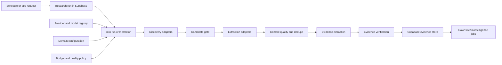

# Research Engine Architecture and Build Plan

Status: proposed MVP baseline  
Owner: Intelligence / AI Lead  
Last reviewed: 2026-09-27

This document decides how the first Research Engine should discover, fetch, clean, deduplicate, evaluate, and store trustworthy information before any downstream intelligence agent analyzes it. It is the planning bridge between the universal research contract and the hands-on n8n build guide.

The central rule is simple: providers are replaceable tools. Tavily, Firecrawl, Exa, Jina, an RSS parser, and a model are not the Research Engine. The Research Engine is our versioned pipeline, quality policy, lineage, and database record.

## Outcome and success criteria

The first implementation should continuously collect useful AI-domain evidence while remaining cheap, inspectable, and safe to replay.

It succeeds when:

- Every accepted evidence item links to its source, excerpt, locator, discovery run, and extraction version.
- A repeated run does not create duplicate sources or evidence.
- Primary and official sources are favored without excluding credible independent reporting.
- Latest-news coverage has a measurable freshness target and does not rely on a single search provider.
- Deterministic code performs filtering, canonicalization, hashing, validation, and routing before a model is called.
- Model output is schema-validated and cannot silently introduce unsupported facts.
- Each run has limits for provider calls, pages, tokens, cost, time, and retries.
- Provider failure produces a visible partial run or a controlled fallback, not fabricated completeness.
- Provider quality is chosen with a gold evaluation set, not marketing claims or free-credit availability.

## Architectural boundaries



- The application backend creates and authorizes a research run.
- Supabase is the state and lineage system.
- n8n coordinates bounded background work.
- Provider adapters discover or extract information through one internal contract.
- Models classify or structure bounded inputs; they do not control workflow state or browse freely.
- Intelligence agents consume accepted evidence packs, never raw search results.

## End-to-end pipeline

### 1. Claim the run

Atomically claim a queued `research_run`. Load its immutable configuration snapshot, domain scope, source policy, budgets, engine version, and contract version. Stop before external calls when the run is already active, terminal, unauthorized, or incompatible.

### 2. Create a bounded discovery plan

Produce stable discovery tasks for:

- Monitored primary sources and their feeds.
- News and web queries.
- Research and developer channels.
- Entity-specific monitoring.
- Optional backfill windows.

Each task has a stable identifier, channel, query or feed URL, time window, result limit, priority, provider order, and maximum cost. Discovery plans must be reproducible from the run snapshot.

### 3. Discover candidates

Discovery returns lightweight candidates: URL, title, publisher, date, snippet, rank, provider, query, and provider metadata. It should not fetch every full page yet.

### 4. Normalize and pre-filter

Map candidates into the universal contract, validate required fields, normalize dates and language, reject unsafe schemes and blocked domains, and apply the run time window.

### 5. Canonicalize and pre-deduplicate

Remove tracking parameters, normalize hosts and paths, follow only bounded safe redirects, resolve known aliases, and check the canonical URL against existing sources. This step prevents spending extraction credits on obvious duplicates.

### 6. Apply a cheap relevance gate

Run deterministic rules first: topic keywords, excluded terms, domain allow/block lists, entity matches, publication date, language, and snippet quality. Only unresolved candidates go to the lowest-cost model that meets the relevance quality threshold.

### 7. Fetch and extract surviving pages

Use a source-appropriate extraction route. Direct feeds and APIs come first; basic HTTP and readable HTML come next; a reader service follows; browser-style crawling is the expensive fallback. Record which route succeeded and every failed attempt.

### 8. Clean and validate content

Remove navigation, cookie notices, repeated page furniture, ads, and unrelated recommendations. Preserve headings, paragraph order, lists, tables when reliable, links, publication metadata, and location markers. Reject empty, consent-only, login-only, unrelated, or obviously truncated content.

### 9. Perform content-level deduplication

Use exact hashes first and near-duplicate logic only on plausible pairs. Preserve the fact that a duplicate was discovered. Syndicated copies may add publisher coverage but must not count as independent evidence.

### 10. Score provenance and content quality

Score the source and document without claiming that the statements are true. Publisher identity, primary-source proximity, author/date clarity, content completeness, citation behavior, and historical reliability are relevant. Keep this score separate from relevance and claim confidence.

### 11. Extract atomic evidence

Chunk accepted content while retaining headings and paragraph locations. Extract one proposition, quote, metric, event, or counter-claim per evidence item. Require a grounded excerpt and locator for every item. A model may normalize wording but may not add facts absent from the supplied content.

### 12. Verify evidence

Deterministically check that excerpts exist, dates and numbers match, referenced source identifiers were supplied, and JSON validates. For high-impact claims, seek an independent source or primary confirmation. Route disputed or unsupported items to review rather than silently accepting them.

### 13. Store, measure, and dispatch

Persist sources, aliases, run decisions, extraction attempts, evidence, usage, and error codes idempotently. Build bounded evidence packs and create downstream intelligence jobs only after minimum coverage and quality gates pass.

## Source strategy

No single provider should own discovery. The MVP should combine monitored sources with query-based discovery.

### Source tiers

| Priority | Channel | Examples | Why it exists | MVP behavior |
|---|---|---|---|---|
| A | Primary and official | Company newsrooms, product changelogs, model cards, GitHub releases, regulator notices, arXiv | Closest to the event or claim | Monitor directly when a feed or stable page exists |
| B | Structured community and research | Hacker News, GitHub APIs, arXiv APIs or feeds, selected public datasets | Timely and machine-readable | Use source-specific adapters and terms-aware storage |
| C | Search discovery | Tavily or Exa; another provider only as approved fallback | Finds material outside monitored lists | Use bounded queries and retain query/rank provenance |
| D | Independent reporting and analysis | Reputable publications, specialist blogs, interviews | Adds context and external verification | Extract when relevant and accessible |
| E | Social or noisy channels | Reddit, X, video comments | Early weak signals | Deferred from automatic acceptance; use only with explicit policy |

Primary sources are not automatically truthful, and multiple syndicated articles are not independent confirmation. The engine records source proximity and publisher diversity separately.

### Latest-news collection

“Latest” is implemented as two complementary paths:

1. **Monitored path:** poll selected RSS/Atom feeds, official newsrooms, changelogs, releases, and research feeds on a schedule. This is cheap, predictable, and fast.
2. **Discovery path:** run time-bounded search queries for topics and entities that are not fully covered by monitored sources. This finds new publishers and unexpected events.

For the first AI-domain release:

- Poll high-priority feeds every 2-4 hours, subject to provider and publisher limits.
- Run a broader daily discovery job.
- Use a 48-hour overlap window so delayed indexing does not create gaps.
- Deduplicate across overlapping runs by canonical URL and content hash.
- Track `published_at`, `first_discovered_at`, and `last_discovered_at` separately.
- Never infer publication time from discovery time when the page does not provide it.

Realtime social ingestion, unrestricted web crawling, and minute-by-minute breaking-news delivery are not MVP requirements.

## Provider architecture

### Internal adapter contracts

A discovery adapter receives:

```json
{
  "task_id": "stable-id",
  "query": "agentic AI funding",
  "time_window": {"from": "2026-09-25T00:00:00Z", "to": "2026-09-27T00:00:00Z"},
  "language": "en",
  "limit": 10,
  "budget": {"max_requests": 1, "max_cost_usd": 0.02}
}
```

It returns a provider-neutral candidate array plus request, latency, and quota metadata.

An extraction adapter receives a URL, content limits, accepted formats, and budget. It returns cleaned content, page metadata, redirect chain, extraction method, hashes, access status, and provider usage. Provider-native payloads remain diagnostic metadata and do not flow into analytical prompts.

### Recommended MVP provider order

Provider details and pricing below were checked on 2026-09-27 and must be rechecked before production commitment.

| Job | Primary route | Fallback | Guardrail |
|---|---|---|---|
| RSS/Atom and structured APIs | Direct HTTP/API adapter | None or delayed retry | Respect publisher terms and cache validators |
| General web/news discovery | Tavily during evaluation | Exa during evaluation | Choose the production default only after gold-set benchmarking |
| Simple readable pages | Direct HTTP plus deterministic readability | Jina Reader | Do not spend crawler credits when plain extraction works |
| Dynamic or difficult pages | Firecrawl basic mode | Firecrawl enhanced mode only for approved retry | Basic and enhanced calls have different credit costs |
| Bulk relevance classification | Cheapest benchmarked open-weight hosted model | Low-cost commercial model | Escalate only ambiguous items |
| Evidence extraction | Best benchmarked small structured-output model | OpenAI low-cost model | Require schema and excerpt validation |
| High-value synthesis | Strong reasoning model | OpenAI senior tier | Not part of ingestion hot path |

Current official free/entry allowances make these suitable for prototyping: Firecrawl and Tavily each advertise 1,000 free monthly credits; Exa advertises monthly starter credits; Jina Reader supports basic URL-to-readable-content usage; Groq exposes hosted open-weight models with free-plan limits. These are bootstrap allowances, not a production capacity promise.

Brave Search is not an MVP default because its published help material says retention of Search API data is prohibited unless separately arranged. That conflicts with a persistent evidence store and must be resolved contractually before use.

### Provider selection scorecard

Benchmark every candidate provider on the same gold set:

- Relevant-result precision and useful coverage.
- Freshness and publication-date accuracy.
- Primary-source discovery rate.
- Extraction completeness and metadata accuracy.
- Duplicate rate and canonical URL quality.
- Latency, timeout, and rate-limit behavior.
- Cost per accepted source, not cost per request.
- Terms for storage, display, training, and retention.
- Operational fit: API stability, quota visibility, and support for retries.

A free provider that produces noisy or non-storable results can be more expensive than a paid provider.

## Canonicalization and deduplication policy

Apply these layers in order:

1. **URL normalization:** lowercase host, remove fragments, normalize trailing slash rules, remove known tracking parameters, sort retained query parameters, normalize default ports, and preserve the original URL.
2. **Redirect and alias resolution:** retain original, final, and canonical URLs; store known aliases instead of losing discovery provenance.
3. **Existing-source match:** unique `(workspace_id, canonical_url)` check before extraction.
4. **Exact-content match:** hash normalized meaningful text after extraction.
5. **Metadata match:** normalized title, publisher, author, and publication-time proximity.
6. **Near-duplicate match:** use SimHash or MinHash for likely article copies after it is benchmarked. Embeddings are not required for MVP deduplication.
7. **Syndication family:** group copies that report the same article; preserve them but count the family once for independent-source diversity.

Never use a language model as the first deduplication mechanism. A model may review borderline cases, but its decision must include both source identifiers and a reason code.

## Cleaning and document-quality policy

The cleaned document should preserve meaning and citation locations while discarding page noise.

Required checks include:

- Minimum meaningful character and paragraph counts.
- Title/body consistency.
- Publication-date plausibility.
- Content language.
- Login, paywall, consent, error-page, and anti-bot detection.
- Duplicate paragraph removal.
- Repeated navigation/footer ratio.
- Maximum response bytes, redirect count, extraction time, and document length.
- Allowed content types; PDFs and transcripts use separate extraction policies.

Store full text only when terms and retention policy allow it. Otherwise store metadata, hashes, a compliant excerpt, locator, and a refetch pointer. The UI must not display complete copyrighted articles merely because the crawler returned them.

## Quality decisions and confidence

Do not collapse quality into one mysterious score. Keep at least these dimensions:

| Dimension | Question |
|---|---|
| Relevance | Does this document address the configured domain, topic, entity, or event? |
| Source quality | Is publisher identity and provenance clear and appropriate for this claim type? |
| Content quality | Did extraction return a complete and coherent document? |
| Evidence faithfulness | Does the evidence statement match the cited excerpt? |
| Corroboration | Is the claim independently supported, disputed, or only single-sourced? |
| Freshness | Is the content timely for this research objective? |

Initial thresholds are deliberately provisional and must be calibrated on the gold set:

- Reject deterministic policy failures immediately.
- Accept relevance at `>= 0.80` when deterministic and model checks agree.
- Send `0.55-0.79` to a stronger gate or review.
- Reject `< 0.55` unless an allowlisted primary source rule applies.
- Require content quality `>= 0.70` before evidence extraction.
- Require excerpt and locator verification for every accepted evidence item.
- Mark consequential single-source claims as `unverified` until corroborated.

Scores are operational features, not user-facing claims of mathematical certainty.

## Model routing

Use models only after deterministic reduction of the workload.

| Tier | Work | Recommended MVP approach |
|---|---|---|
| 0 | URL handling, filters, hashes, validation, retries, storage | JavaScript, SQL, and database functions |
| 1 | Ambiguous relevance, topic labels, narrow metadata | Benchmark a hosted open-weight model through Groq and a free/low-cost alternative |
| 2 | Atomic evidence extraction and selected signal structuring | Benchmark the best small structured-output model; use OpenAI low-cost model as fallback if it materially improves faithfulness |
| 3 | Contradictions, patterns, hypotheses, and final validation | Reserve OpenAI stronger reasoning models for later intelligence stages |

“Open source model” in this plan normally means an open-weight model served by an external inference provider. n8n Cloud does not host the model itself. Running a model on our own hardware requires a separate inference service and is deferred until utilization justifies its operations cost.

Every model call must specify capability, prompt version, schema version, input/output limits, maximum attempts, maximum cost, and fallback. Record failures and token usage. Do not automatically send the same sensitive content to a second provider unless the run policy allows it.

## Evaluation before vendor lock-in

Build a reviewed gold set before choosing defaults:

- 100 discovery results across current AI topics, companies, research, funding, and product releases.
- At least 25 irrelevant or spam candidates.
- At least 20 duplicate or syndicated pairs.
- At least 20 difficult extraction cases, including dynamic pages and PDFs.
- At least 50 source-grounded evidence items with accepted excerpts and locators.
- Negative examples: unsupported claims, wrong dates, wrong numbers, paywalls, consent pages, and stale content.

Measure:

- Relevance precision first, then recall.
- Extraction success and completeness.
- Exact and near-duplicate precision.
- Evidence attribution and excerpt faithfulness.
- Unsupported-claim rate.
- p50 and p95 latency.
- Provider calls, tokens, and cost per accepted source and evidence item.

The initial quality gates are:

- No accepted evidence without valid lineage.
- At least 95% precision for automatic relevance acceptance on the gold set.
- At least 98% exact-duplicate detection.
- At least 95% evidence excerpt-faithfulness.
- Zero silent schema-validation failures.

If a model or provider misses the gate, keep it out of automatic acceptance even if it is free.

## Budget and quota policy

Free credits are shared experimental capacity. They must be represented in configuration and usage logs, not assumed to be always available.

Provisional first vertical-slice limits:

| Limit | Default |
|---|---:|
| Search queries per manual run | 5 |
| Candidates retained per query | 10 |
| New pages extracted per run | 20 |
| Enhanced crawler retries per run | 2 |
| Evidence-bearing sources per run | 10 |
| Model attempts per item | 2 |
| Wall-clock target | 10 minutes |
| OpenAI ingestion spend ceiling | USD 0.25 per run |
| Total paid-provider ceiling | USD 0.50 per run |

These are safe starting limits, not product promises. After ten representative runs, tune them from evidence yield and cost. The most restrictive per-call, per-run, daily-workspace, or provider limit always wins.

When a limit is reached:

- Stop optional work.
- Preserve completed items.
- Mark the run `partial` with a reason.
- Do not silently switch to an unapproved provider.
- Show remaining work and usage in operations metrics.

## n8n workflow decomposition

The hands-on implementation should use a thin parent and small child workflows:

| Workflow | Responsibility | No hidden responsibility |
|---|---|---|
| `RE 00 Orchestrator` | Claim run, call stages, enforce global budget, finalize | Does not parse source content |
| `RE 10 Plan` | Generate stable tasks from configuration | Does not call external providers |
| `RE 20 Discover Direct` | RSS, official feeds, structured APIs | Does not analyze evidence |
| `RE 21 Discover Search` | Search-provider adapter and fallback | Does not fetch all pages |
| `RE 30 Candidate Gate` | Normalize, canonicalize, pre-dedupe, relevance | Does not generate signals |
| `RE 40 Extract` | Route direct, reader, or crawler extraction | Does not judge claim truth |
| `RE 50 Content Gate` | Clean, hash, content-dedupe, quality checks | Does not synthesize articles |
| `RE 60 Evidence` | Chunk, extract, validate atomic evidence | Does not detect patterns |
| `RE 70 Corroborate` | Match claims, track support/conflict/diversity | Does not force a conclusion |
| `RE 80 Persist` | Idempotent database operations and lineage | Does not accept client authority |
| `RE 90 Finalize` | Metrics, cost, partial/failure status, downstream jobs | Does not hide stage failures |

Keep prompts, JSON Schemas, canonicalization rules, and non-trivial transformations in version-controlled files or database functions. n8n nodes should show orchestration, not become the only copy of business logic.

## State, retry, and failure behavior

Every external operation receives a stable task and attempt identifier. A retry updates the same logical task.

| Failure | Response |
|---|---|
| Provider 429 | Honor retry hint, bounded exponential backoff, then approved fallback |
| Provider 5xx or timeout | Bounded retry only for idempotent calls |
| Authentication or quota exhausted | Stop that adapter, record it, continue only if minimum coverage remains possible |
| Invalid candidate shape | Reject item with a contract reason code |
| Empty or blocked page | Record access status; do not repeatedly crawl in the same run |
| Invalid model JSON | One repair attempt within the same budget, then review/reject |
| Unsupported evidence | Reject evidence while retaining diagnostic output |
| Database conflict | Use upsert/transaction and reload canonical record |
| Run timeout | Persist progress and mark partial or failed based on accepted yield |

Errors stored for product use must be sanitized. Provider secrets, full prompts containing sensitive content, and raw credentials never enter frontend-readable tables.

## Database additions to review before migrations

The logical database schema already covers runs, sources, evidence, usage, and jobs. The implementation should review these additional operational records:

- `research_tasks`: stable planned task, stage, status, priority, limits, attempt count, and error.
- `source_aliases`: original/final/canonical URL relationships and canonicalization version.
- `source_fetches`: extraction attempts, provider, status, HTTP metadata, timing, content hash, storage pointer, and cost.
- `provider_usage`: discovery/extraction requests and non-LLM credit or currency usage.
- `review_items`: borderline relevance, duplicate, source verification, evidence, and entity-resolution decisions.
- `claim_groups`: optional later table for equivalent claims, corroboration, contradiction, and syndication independence.

These are backend and operations tables; the frontend should consume stable views rather than construct workflow state from them.

## Testing strategy

### Contract tests

- Every adapter returns the same normalized shape.
- Required identifiers, versions, dates, scores, and URLs validate.
- Unknown provider fields remain isolated in metadata.

### Deterministic unit tests

- URL canonicalization corpus, including false-merge cases.
- Date, language, hash, and cleaning rules.
- Budget arithmetic and stop conditions.
- Run status transitions and idempotency keys.

### Integration tests

- Recorded provider fixtures for success, empty result, rate limit, timeout, malformed payload, and quota exhaustion.
- Database upsert and cross-workspace rejection.
- Partial-run finalization and replay.

### Quality evaluation

- Run each provider and model against the versioned gold set.
- Require review before changing an automatic-acceptance model, prompt, threshold, or extraction route.
- Keep cost and latency results next to quality results.

### End-to-end acceptance

A seeded run must discover, deduplicate, extract, store, and cite a known set of documents; a replay must not create new canonical sources or accepted evidence.

## Performance plan

- Run independent discovery tasks concurrently within provider and n8n Cloud limits.
- Limit extraction concurrency more aggressively than discovery.
- Batch model classification only when per-item lineage remains intact.
- Check existing canonical URLs before fetching content.
- Cache safe extraction results by canonical URL, content validator, and policy-defined freshness.
- Avoid embeddings and vector search until measured query or deduplication needs justify them.
- Track p50/p95 latency per stage so a slow provider can be replaced without redesigning the engine.

## Build sequence

### Phase 0: evaluation foundation

1. Finalize provider and model adapter contracts.
2. Create the 100-result gold set and review labels.
3. Add provider terms, quota, and price configuration.
4. Benchmark Tavily versus Exa for discovery.
5. Benchmark direct extraction, Jina Reader, and Firecrawl for extraction.
6. Benchmark at least one hosted open-weight model and one low-cost commercial model for relevance and evidence extraction.
7. Confirm content storage and retention rules.

Exit: defaults and fallbacks are selected with recorded quality, cost, latency, and terms evidence.

### Phase 1: narrow vertical slice

1. Use one domain: Artificial Intelligence.
2. Support manual runs only.
3. Use three channels: selected official/RSS feeds, one search provider, and arXiv/GitHub structured sources.
4. Implement canonical URL and exact-content dedupe.
5. Implement one normal extraction route and Firecrawl fallback.
6. Store sources, run decisions, usage, and evidence.
7. Produce an operations summary; do not generate patterns or hypotheses yet.

Exit: ten representative runs can be replayed without duplicate accepted data and meet lineage/quality gates.

### Phase 2: scheduled current-awareness

1. Add monitored-source scheduling and 48-hour overlap.
2. Add provider fallback and partial-run handling.
3. Add content near-duplicate and syndication grouping.
4. Add review queue and alerting.
5. Tune budgets and freshness from real usage.

Exit: daily collection operates for seven days without silent gaps, uncontrolled spend, or untraceable evidence.

### Phase 3: intelligence handoff

1. Build bounded evidence packs.
2. Queue signal and entity jobs.
3. Add claim corroboration and contradiction tracking.
4. Benchmark the first downstream agent separately.

Exit: intelligence agents operate only on accepted, bounded, traceable evidence packs.

## Explicitly not in the first build

- Crawling the whole web or entire sites by default.
- Realtime social firehoses.
- Self-hosting large models.
- Vector search chosen before a measured need.
- Autonomous provider switching outside an approved route.
- Pattern, hypothesis, or validation agents inside ingestion.
- Treating multiple copies of one press release as independent confirmation.
- Storing or displaying full copyrighted content without a defined right and retention policy.

## Decisions still requiring explicit approval

The architecture can proceed now, but the hands-on n8n guide must label these values as configuration until they are approved:

1. Content storage and retention by source type.
2. Final default between Tavily and Exa after the gold-set benchmark.
3. The hosted open-weight and low-cost commercial models that meet the quality gates.
4. Daily schedule and paid-provider ceiling after ten manual runs.
5. Which official AI sources form the initial monitored list.
6. Review ownership and response expectations.

## Definition of ready for the n8n hands-on guide

The guide can be written and executed when:

- Adapter inputs and outputs are accepted.
- The initial three discovery channels are named.
- Provider credentials are available in n8n credentials, not workflow JSON.
- The gold set and acceptance metrics exist.
- Storage and retention behavior is approved.
- Required database operational tables or equivalent functions are agreed.
- Per-run limits and fallback order are configured.

At that point, the guide should implement `RE 00` through `RE 50` first, test the complete source pipeline, and only then add model-based evidence extraction.

## Provider references

- Firecrawl billing and credits: <https://github.com/firecrawl/firecrawl-docs/blob/main/billing.mdx>
- Firecrawl plans: <https://www.firecrawl.dev/pricing>
- Firecrawl basic and enhanced extraction: <https://docs.firecrawl.dev/features/stealth-mode>
- Tavily plans: <https://www.tavily.com/pricing>
- Tavily API examples: <https://docs.tavily.com/examples/quick-tutorials/cookbook>
- Exa plans: <https://exa.ai/pricing>
- Jina Reader: <https://jina.ai/reader/>
- Brave Search API plans: <https://api-dashboard.search.brave.com/app/plans>
- Brave Search API retention guidance: <https://api-dashboard.search.brave.com/documentation/resources/help-feedback>
- Groq supported models: <https://console.groq.com/docs/models>
- Groq rate limits: <https://console.groq.com/docs/rate-limits>
- Gemini API pricing: <https://ai.google.dev/gemini-api/docs/pricing>
- OpenAI models: <https://developers.openai.com/api/docs/models>
- OpenAI API pricing: <https://developers.openai.com/api/docs/pricing>
- OpenAI model selection: <https://developers.openai.com/api/docs/guides/model-selection>
- OpenAI structured outputs: <https://developers.openai.com/api/docs/guides/structured-outputs>
