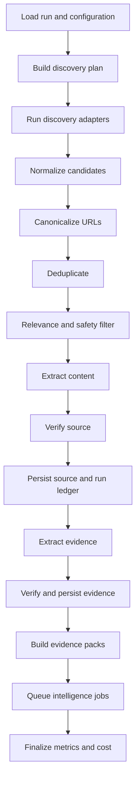

# Research Engine Workflow

The Research Engine is the only shared path from external discovery to accepted evidence. It is a reusable, domain-configured workflow rather than a hardcoded AI Radar. Downstream intelligence engines receive evidence packs and do not independently browse the web.

## Trigger contract

A run begins from a server-created `research_runs` row and a signed internal request containing:

```json
{
  "research_run_id": "uuid",
  "request_id": "uuid",
  "idempotency_key": "stable-unique-value"
}
```

n8n loads the workspace, domain configuration, thresholds, source adapters, time window, and budget from the database. It does not trust client-supplied configuration sent directly to a public webhook.

## Workflow stages



## Stage specifications

### 1 Load run and configuration

Inputs: `research_run_id`.

Actions:

- Lock or atomically claim the queued run.
- Verify it is not completed or cancelled.
- Load workspace-domain configuration and budget.
- Record engine and contract versions in the run snapshot.
- Change status to `discovering`.

Failure: reject missing, unauthorized, already-active, or incompatible runs before any provider call.

### 2 Build discovery plan

Create bounded queries per topic, geography, entity type, source channel, and time window. Reuse query templates from version-controlled configuration. Assign each adapter a result limit and cost budget.

Output: discovery tasks with stable task identifiers so retries do not create new logical tasks.

### 3 Run discovery adapters

Adapters return channel-native results plus discovery provenance. Run independent adapters concurrently within provider rate limits. Record adapter failure separately; one channel failure may produce a partial run rather than total failure.

Adapters do not call analytical engines or write signals.

### 4 Normalize candidates

Map provider fields into the Universal Research Contract. Validate required URL, title, discovery time, scope, and schema version. Reject malformed candidates with a reason code.

### 5 Canonicalize URLs

Use deterministic, versioned URL rules. Perform network redirect resolution only when safe and bounded. Retain original URL, final URL, and canonicalization version for debugging.

### 6 Deduplicate

Apply in order:

1. Exact canonical URL within workspace.
2. Known URL alias mapping.
3. Exact content hash after extraction when available.
4. Near-duplicate comparison only if benchmarked and auditable.

A duplicate is recorded in `research_run_sources`; it is not silently discarded. Update `last_discovered_at` on the canonical source.

### 7 Relevance and safety filter

Use deterministic exclusions first: unsupported schemes, blocked domains, time window, language policy, and obvious spam. Use a Tier 1 model only for semantic relevance that rules cannot resolve.

Persist relevance score, decision, and reason codes. Borderline candidates become `needs_review` or follow a configured stronger-model gate.

### 8 Extract content

Prefer source-appropriate deterministic extraction. Bound response size, redirects, time, file type, and retries. Treat robots, licensing, paywalls, and access restrictions explicitly.

Store permitted cleaned content in private storage and a hash in the database. Never put untrusted page instructions into workflow control context.

### 9 Verify source

Run checks appropriate to source type. Examples include publisher identity, publication time, primary-source proximity, consistency between structured metadata and content, and safe locator creation.

Verification is evidence about provenance and integrity, not a guarantee that every source statement is true.

### 10 Persist source and run ledger

Use an upsert or database function keyed by workspace and canonical URL. The transaction must:

- Create or update the source.
- Add the research-run discovery record.
- Preserve every decision and reason.
- Reject any cross-workspace parent mismatch.
- Be idempotent on retry.

### 11 Extract evidence

Split content into bounded chunks while preserving location. Extract atomic propositions, quotes, metrics, and events. Every output points to the source and locator and validates against the evidence contract.

The model may normalize language but may not introduce facts absent from the source.

### 12 Verify and persist evidence

Validate excerpt presence, locator integrity, dates, numbers, and referenced entities. Reject unsupported claims. Persist accepted and disputed evidence; retain rejected-output diagnostics for evaluation without exposing them as product evidence.

### 13 Build evidence packs

Group accepted evidence by analytical objective, time window, topic, and entity while enforcing token and source-diversity limits. Packs contain identifiers, bounded excerpts, metadata, and retrieval criteria. They do not contain arbitrary raw search lists.

### 14 Queue intelligence jobs

Create separate idempotent jobs for ecosystem signals, investment signals, entity resolution, and thesis extraction. Later pattern jobs consume accepted signals and observations, not raw discovery results.

### 15 Finalize run

Calculate stage counts, duplicates, rejection reasons, extraction success, evidence yield, source diversity, duration, and cost. Mark:

- `completed` when mandatory coverage succeeds.
- `partial` when useful results exist but a coverage or adapter requirement failed.
- `failed` when no trustworthy output can be produced.

## Workflow decomposition in n8n

Use a thin parent workflow and reusable child workflows:

```text
RE 00 Orchestrator
RE 10 Discovery Planner
RE 20 Adapter Web Search
RE 21 Adapter RSS and Official Sites
RE 22 Adapter Structured Ecosystem
RE 30 Normalize Canonicalize Deduplicate
RE 40 Relevance Filter
RE 50 Content Extraction
RE 60 Source Verification
RE 70 Evidence Extraction and Verification
RE 80 Evidence Pack Builder
RE 90 Finalize and Dispatch
```

Nodes with substantial transformation logic should call version-controlled code or database functions rather than hide large scripts inside the UI.

## Retry and idempotency policy

| Failure class | Retry | Behavior |
|---|---:|---|
| Rate limit | Yes | Exponential backoff with jitter and provider hint |
| Temporary network or provider 5xx | Yes | Bounded retries |
| Timeout | Limited | Retry only if operation is idempotent |
| Invalid structured model output | Once or twice | Repair prompt, then fail item |
| Authentication or permission | No | Fail adapter or run and alert |
| Contract version mismatch | No | Fail before side effects |
| Validation or cross-workspace mismatch | No | Reject and audit |
| Content blocked or paywalled | No | Record blocked status |

Retry count and last error live in the job or run ledger. A retry never creates duplicate accepted objects.

## Observability and quality metrics

Minimum run metrics:

- Candidate count by adapter.
- Accepted, rejected, duplicate, review, and failed counts.
- Rejection reasons.
- Canonicalization and content-hash duplicate rates.
- Extraction success and blocked rate.
- Evidence items per accepted source.
- Source quality and relevance distributions.
- Unique publishers and entity coverage.
- Stage latency and retry count.
- Token usage and cost by capability.
- Intelligence jobs queued and completed.

## Human review queues

The first release should support a basic operations view for borderline relevance, disputed verification, possible entity merges, unsupported evidence extraction, and repeated workflow failures. Human changes create audit events and never overwrite the original automated decision without history.

## Definition of done

A Research Engine run is done when its run row has a terminal status, metrics and cost are finalized, every accepted evidence item traces to an accepted source and run, downstream jobs have stable identifiers, partial failures are visible, and the workflow can be replayed without duplicating accepted data.
